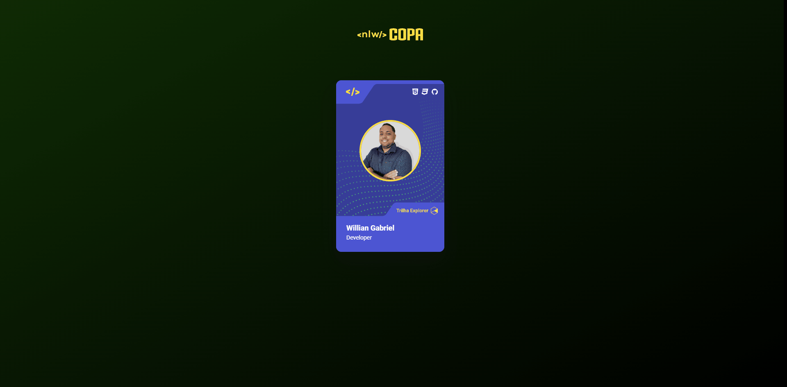

<h1 align="center"> Card Copa 2022 </h1>

Card copa 2022

  <a href="#-tecnologias">Tecnologias</a>&nbsp;&nbsp;&nbsp;|&nbsp;&nbsp;&nbsp;
  <a href="#-projeto">Projeto</a>&nbsp;&nbsp;&nbsp;|&nbsp;&nbsp;&nbsp;
  <a href="#-layout">Layout</a>&nbsp;&nbsp;&nbsp;|&nbsp;&nbsp;&nbsp;
  <a href="#memo-licença">Licença</a>&nbsp;&nbsp;&nbsp;|&nbsp;&nbsp;&nbsp;

  

 

  

## 🚀 Tecnologias

Esse projeto foi desenvolvido com as seguintes tecnologias:

- HTML e CSS
- JavaScript

## 💻 Projeto

Figurinha da Copa

## 🔖 Layout

Você pode visualizar o layout do projeto através [DESSE LINK](https://williangabriell.github.io/nlw-copa-card/). É necessário ter conta no [Figma](https://www.figma.com/design/n4a3jhGZQzysXClp99bfyT/NLW-Copa-Card/duplicate) para acessá-lo.

## 📝 Licença

Esse projeto está sob a licença MIT.
